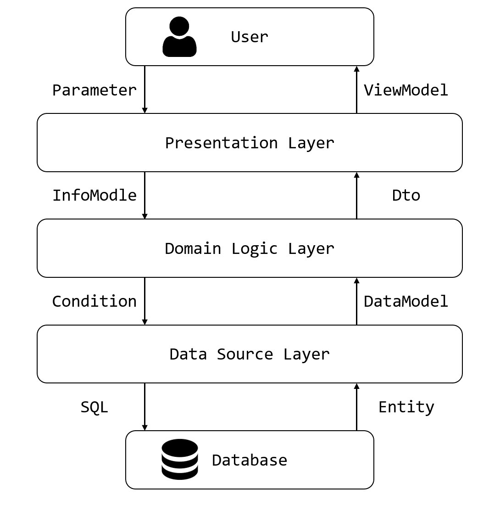

# 專案架構
該專案採用三層架構，分別是展示層的WebApi、業務層的Servic以及資料層的Repository，由於專案內容較為簡單，因此不採用共用層 (Common Layer)。

雖然此專案較為簡單，以至於業務層的邏輯基本都是簡單的資料物件轉換，但對比了上一個專案的內容可以發現，透過了分層的方式，隔離了不同的職責以及關注點，因此更有模組化的系統，未來也能開始編寫單元測試。

# 筆記
## 三層架構
三層架構是一種常見的企業級軟體開發架構，他將應用程式分成了三個職責分明的層級：展示層(Presentation)、領域邏輯層(Domain Logic)以及資料來源層(Data Source)，此處命名在不同地方略有差異，但根本邏輯與職責是相同的。

